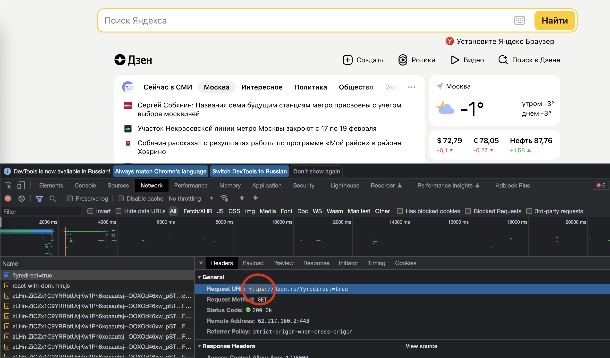
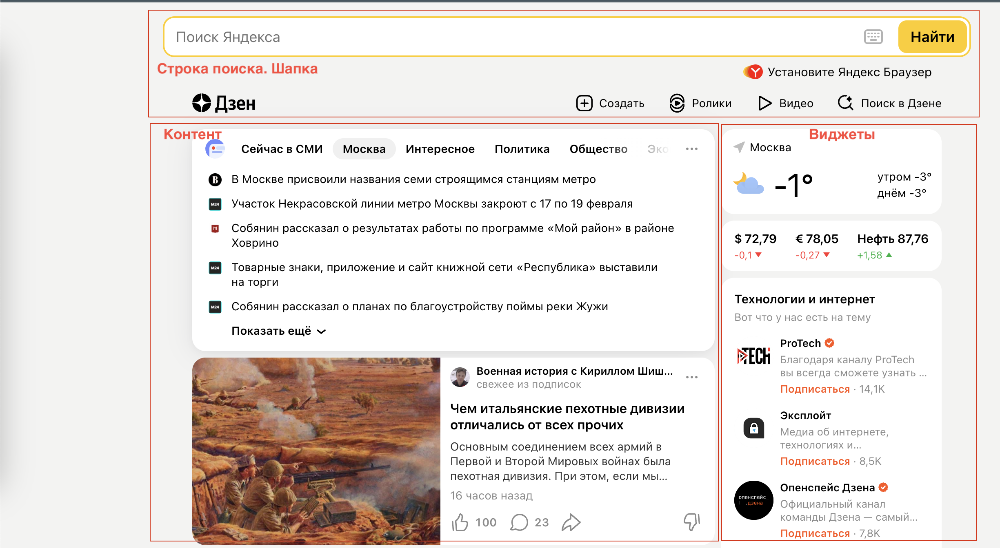
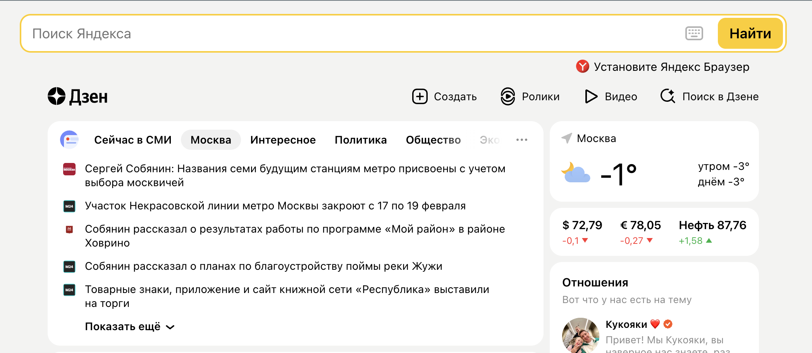
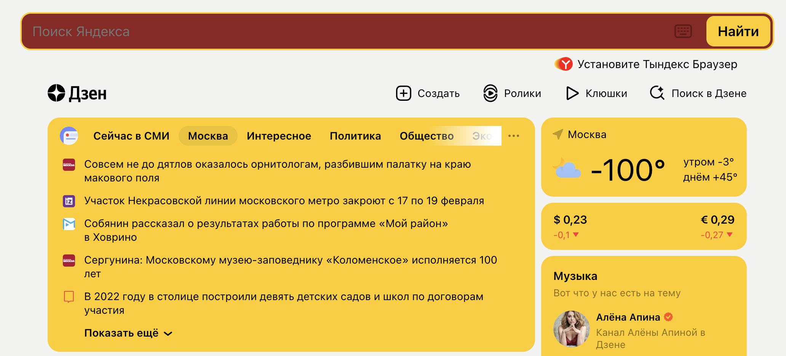
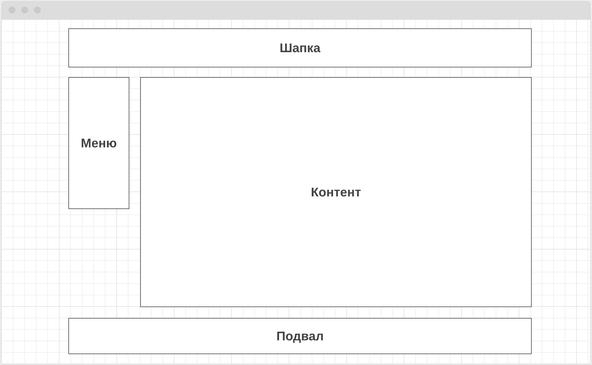

## Урок 1. Веб-технологии: вчера, сегодня, завтра

На основе сайта **yandex.ru**: 
1. Определите, на каком протоколе работает сайт:

2. Проанализируйте структуру страницы сайта.

3. Внесите не менее 10 изменений на страницу с помощью инструмента разработчика и представьте скриншоты было/стало.

  

4. Создайте прототип низкой детализации (дополнительное задание, если на семинаре дошли до задания №8:

